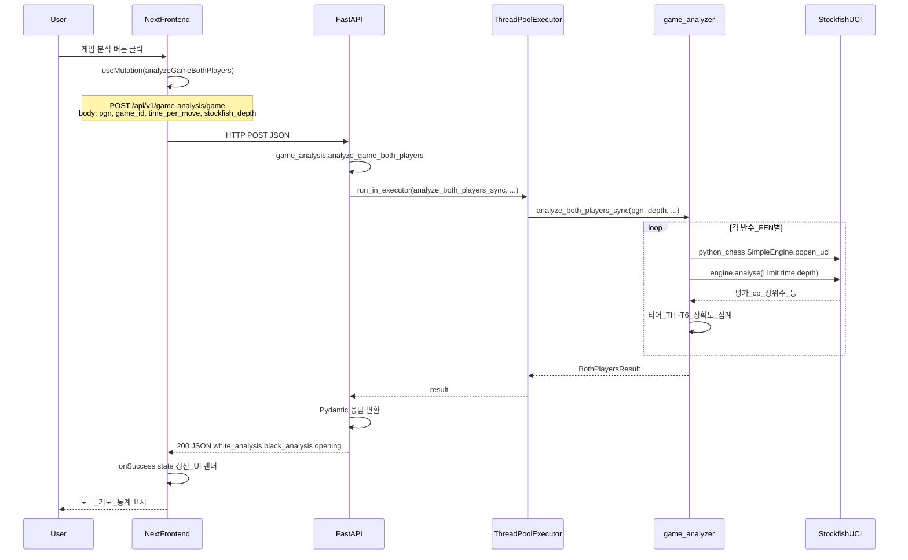
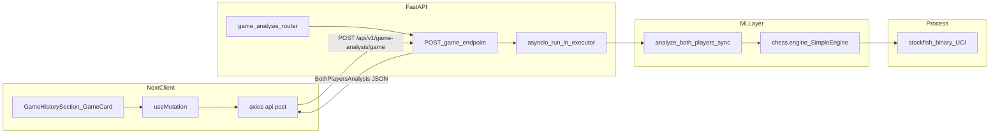

# 체스 게임 분석 흐름 (프론트 → FastAPI → Stockfish)

> **최신 상세**: 스케줄링(Semaphore·캐시)·SSE·분석 로직은 [analysis-scheduling-and-logic.md](./analysis-scheduling-and-logic.md)를 참고하세요. 아래 표의 엔드포인트/함수명은 구버전일 수 있습니다.  
> **배포**: 프론트 Vercel + API Azure for Students → [azure-deployment.md](./azure-deployment.md)

Foresight에서 **개별 게임 수 품질 분석**이 동작하는 경로를 정리한 문서입니다.  
Mermaid 확장(미리보기)으로 아래 다이어그램을 렌더링할 수 있습니다.

## 엔드포인트·파일 참조

| 구분 | 내용 |
|------|------|
| HTTP | `POST /api/v1/game-analysis/game` |
| 프론트 호출 | [`frontend/src/shared/lib/api.ts`](../frontend/src/shared/lib/api.ts) — `analyzeGameBothPlayers` |
| UI 트리거 | [`frontend/src/features/dashboard/components/GameHistorySection.tsx`](../frontend/src/features/dashboard/components/GameHistorySection.tsx) — `useMutation` |
| FastAPI 라우트 | [`backend/app/api/routes/game_analysis.py`](../backend/app/api/routes/game_analysis.py) |
| 분석 로직 | [`backend/app/ml/game_analyzer.py`](../backend/app/ml/game_analyzer.py) — `analyze_both_players_sync`, `SimpleEngine.popen_uci` |

---

## 시퀀스 다이어그램

---

## 흐름 요약 (flowchart)

---

## 요약

1. 사용자가 대시보드에서 게임 카드의 분석을 실행하면, 프론트가 PGN·게임 ID·Stockfish depth 등을 담아 API로 POST합니다.
2. FastAPI는 이벤트 루프를 막지 않도록 `run_in_executor`로 동기 분석 함수를 실행합니다.
3. `game_analyzer`가 `python-chess`로 Stockfish UCI 프로세스를 띄우고, 수마다 분석·티어 산출 후 양측 플레이어 결과를 합쳐 JSON으로 반환합니다.
4. 프론트는 응답으로 보드·기보·정확도 UI를 갱신합니다.

---

## 타임아웃·배포 참고

- **프론트**: `analyzeGameBothPlayers` 요청은 한 판 전체 분석에 **최대 약 15분**(`900_000` ms)까지 기다립니다. (depth 고정 분석은 수가 많으면 3분을 쉽게 넘깁니다.)
- **리버스 프록시(Nginx 등)**: `proxy_read_timeout` 기본값(예: 60초)이 짧으면 브라우저보다 먼저 연결이 끊깁니다. 게임 분석 API 경로에 **900s 이상** 등으로 늘리는 것을 권장합니다.
